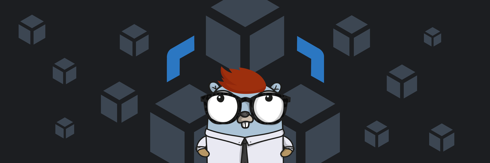

# Jot


Introducing a tool for effortlessly creating projects following the micro-services architecture. This tool streamlines project generation with modular components. It simplifies the complexities of micro-services development, empowering the delivery of high-quality, scalable projects with ease.

## Installation

```
go install -v github.com/AdamShannag/jot/v2/cli/cmd/jot@latest
```

## How to Use This Tool

To generate a service, endpoint, or middleware using this tool, follow these simple steps:

### Creating a Service

1. Run the command: `jot new`
2. Choose the option for creating a service.
3. Provide a name for your service and specify the port.
4. If this is a new project, also enter the project path.

### Creating an Endpoint or Middleware

1. Run the command: `jot new`
2. Select either "endpoint" or "middleware" as your choice.
3. Choose the service where you want to add the endpoint or middleware.
4. Enter the name for your endpoint or middleware.

These straightforward steps will help you generate the necessary components for your project.

## Project Generation using code

You can leverage the built-in API along with writer modules to create your projects in Golang. The API provides builders for projects, services, endpoints, and middleware. After constructing the project structure, simply pass it to the project writer and call the `Write(path)` method to generate your project.
